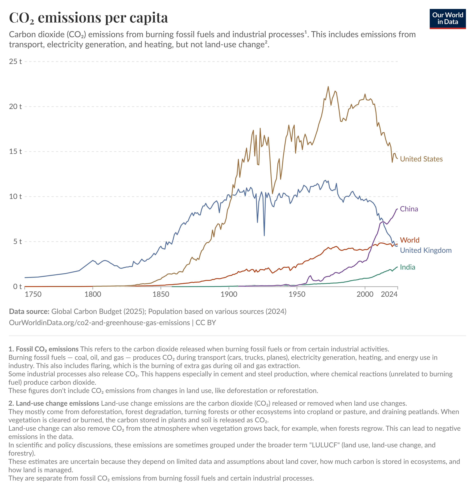

# Exercise 2 – Evaluation of a Data Visualization

## 1. Visualization Selected

Source: Our World in Data

This visualization presents the evolution of carbon dioxide (CO₂) emissions over time for several countries. The data is represented as a line chart with time on the x-axis and emissions on the y-axis.

---

## 2. Main Visualization Goal (Audience)

The main goal of this visualization is to communicate how CO₂ emissions have evolved over time and to allow comparison between different countries.

The intended audience includes:

- Researchers and scientists studying climate change
- Policy makers working on environmental policies
- The general public interested in sustainability and environmental impact

The visualization helps users quickly identify trends, such as which countries contribute most to global emissions and how emissions have changed over decades.

---

## 3. Visualization Dimensions (Visualization Wheel)

Using Alberto Cairo’s visualization wheel:

**Abstraction – Figuration**

The chart is highly abstract because it uses lines and axes to represent numerical data rather than real-world objects.

**Functionality – Decoration**

The visualization prioritizes functionality over decoration. The design focuses on clearly representing the data rather than aesthetic embellishment.

**Density – Lightness**

The chart has moderate density because it contains multiple lines representing different countries, but it remains readable.

**Multidimensionality**

The visualization represents several dimensions:
- Time
- CO₂ emissions
- Country

**Familiarity**

Line charts are widely used and familiar to most viewers, making the visualization easy to interpret.

---

## 4. Drawbacks (According to Cairo and Tufte)

Following principles from Alberto Cairo and Edward Tufte:

**Potential drawbacks include:**

1. Too many lines may make the visualization harder to read if many countries are included.

2. Color differences between lines must be clear; otherwise viewers may struggle to distinguish countries.

3. If axes or labels are not clear enough, viewers may misinterpret the values.

4. The chart may imply relationships between countries even though each line represents independent data.

However, overall the visualization respects Tufte's principle of graphical integrity because the data representation is proportional and not distorted.

---

## 5. Graphical Variables Used

The visualization uses several graphical variables:

**Position**

Position on the x-axis represents time, and position on the y-axis represents CO₂ emissions.

**Color**

Different colors are used to distinguish countries.

**Shape**

Lines connect data points to show the evolution of emissions over time.

These graphical variables are appropriate because:

- Position accurately represents numerical values
- Color allows easy differentiation between countries
- Lines effectively communicate trends over time

---

## Conclusion

This visualization effectively communicates long-term trends in CO₂ emissions and allows comparison between countries. The chart also highlights important historical trends, such as the decline in per-capita emissions in the United Kingdom and the rapid increase in China during the late 20th and early 21st centuries. It follows many recommended data visualization principles such as clarity, appropriate graphical variables, and minimal chart junk. However, readability could decrease if too many countries are displayed simultaneously.

---

## Group Members

- 29211 – Aster Noel Dsouza  
- 29400 – David Heleno Bebiano da Costa Morais